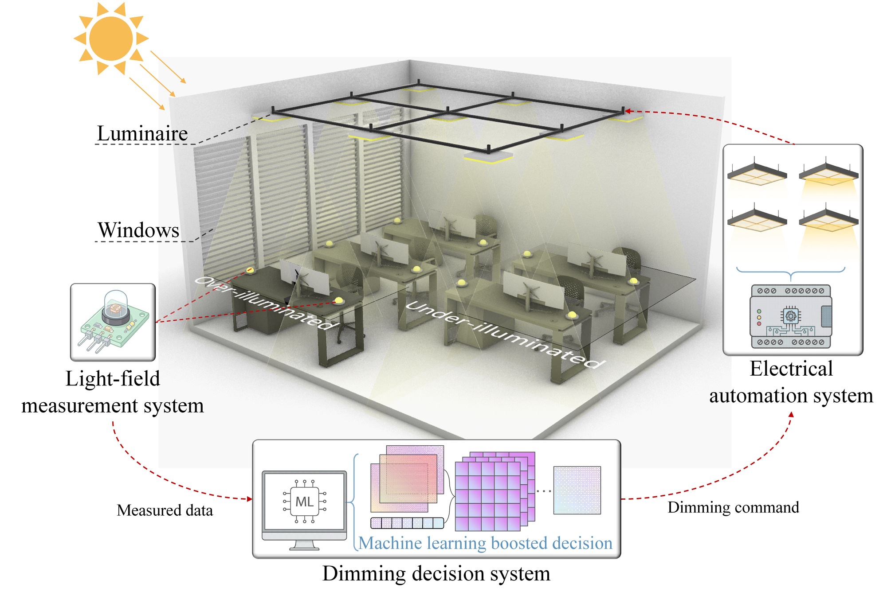
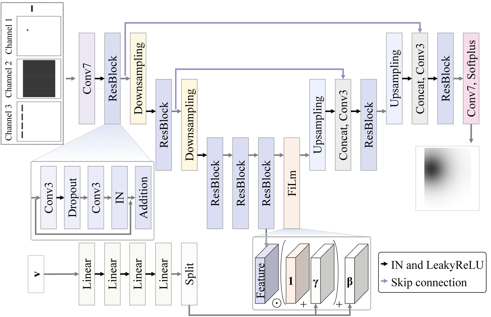
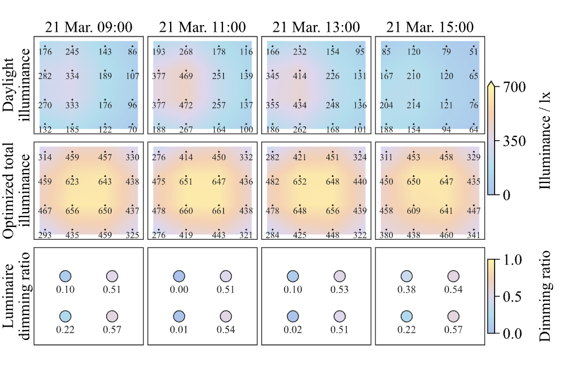
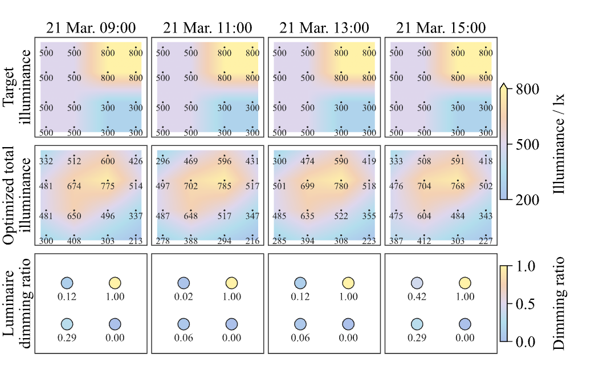
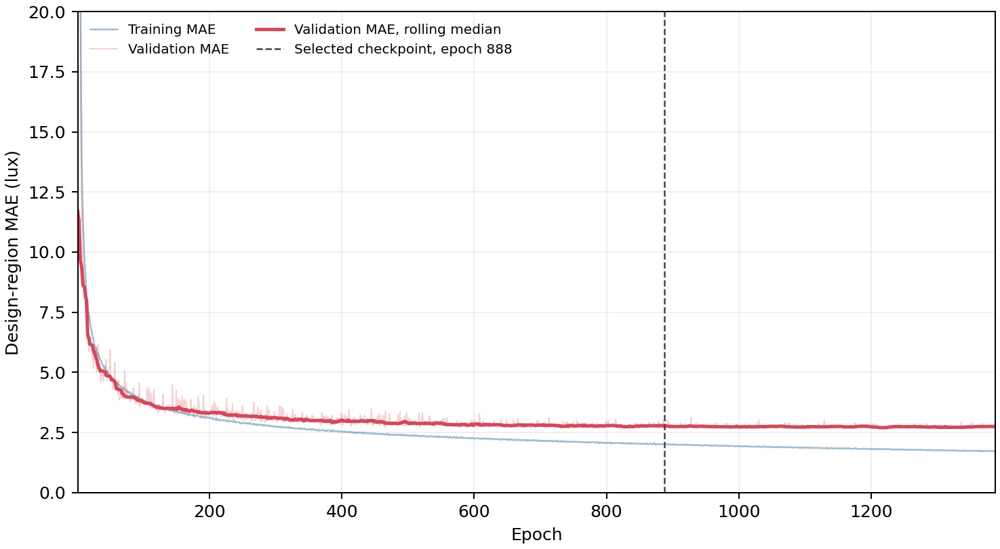

# LuxNet ML RDC

<p align="center">
  <b>Multimodal illuminance prediction and real-time daylight-responsive lighting control</b>
</p>



LuxNet is a deep-learning workflow for integrated daylight and electric-lighting control. A multimodal surrogate model predicts the illuminance distribution produced by each luminaire, and particle swarm optimization determines suitable dimming levels for the current daylight condition.

The repository provides a compact workflow covering data preparation, model training, validation, testing, and lighting-control demonstrations.

## Publication

This repository accompanies the following paper:

> Qiang Zeng, Tao Wang, Yingying Zhang, Shaojun Zhu, Junhao Xu, and Yushuai Zhao. **Real-time dimming control of integrated daylight and electric lighting systems using a multimodal generative surrogate model.** *Building and Environment*, 305, 115203, 2026. [DOI: 10.1016/j.buildenv.2026.115203](https://doi.org/10.1016/j.buildenv.2026.115203) · Web of Science accession number: `WOS:001874521300001`

## Method

The surrogate model is a multimodal residual U-Net. It receives three spatial channels describing the luminaire position, room region, and window projection, together with an 11-value vector describing the room, window, luminaire, and surface properties.

The network predicts a 128 × 128 electric illuminance field in lux. In multi-luminaire rooms, individual fields are combined by linear superposition. A particle swarm optimizer then searches for luminaire dimming ratios according to the daylight field and target illuminance.



## Results from the paper

The representative dimming response below is taken directly from Fig. 7(a) of the paper. It shows how the optimized total illuminance and luminaire dimming ratios respond to daylight changes during the day.



The personalized-target example is taken directly from Fig. 15. Different parts of the room use different illuminance targets, and the controller adjusts the luminaires accordingly.



## Quick start

Python 3.10 or 3.11 is recommended.

```bash
python -m venv .venv
.venv\Scripts\activate
pip install -r requirements.txt

python -m unittest discover -s tests -v
python evaluate.py --split test
python demo.py --case case01
python demo.py --case case07 --personalized
```

Generated files are written to `outputs/`.

## Full dataset and training

Download `luxnet_dataset_4000.zip` from the GitHub release and extract it with:

```bash
python scripts/extract_dataset.py path/to/luxnet_dataset_4000.zip
```

Then run:

```bash
python evaluate.py --data data/full --splits data/splits.json --split test
python train.py --data data/full --splits data/splits.json --output outputs/train_01
```

The dataset contains model inputs, physical condition vectors, illuminance targets, and readable scene metadata. See [DATASET.md](DATASET.md) for the file definitions.

## Training process

The repository includes the archived training history and a pretrained MResUNet checkpoint for evaluation and demonstration.



## Repository structure

```text
luxnet/       model, data encoding, metrics, loss, and optimization code
data/         split files and a small runnable sample
examples/     two lighting-control examples
results/      training history and saved evaluation results
scripts/      dataset utility scripts
tests/        basic model and optimization checks
weights/      pretrained MResUNet checkpoint
train.py      model-training entry point
evaluate.py   validation and test entry point
demo.py       end-to-end dimming demonstration
```

Citation metadata is provided in `CITATION.cff`.

